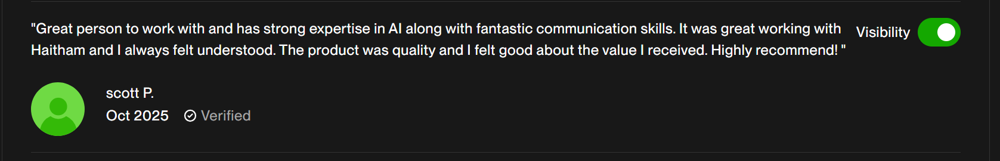

# AI & Engineering Portfolio | Haitham Elmekaoui
**Specialized in NLP, Generative AI, and Quantitative Machine Learning**

Professional showcase of end-to-end AI solutions, startup leadership, and competitive data science.

---

## 🏆 Key Achievements
* **4th Place Winner - Capgemini Techathon (2025):** Developed a high-impact technical solution under strict competitive constraints within 48 hours.
> 

---

## 🚀 Professional Projects (NDA Restricted)

### 1. Intelligent Patent Monitor (USPTO)
**Role:** Lead AI Engineer | **Client:** Scott (via Upwork)
* **Objective:** Automate the classification of massive USPTO patent datasets to identify business opportunities.
* **Technical Stack:** Python, **SetFit (Sentence Transformer Fine-tuning)**, HuggingFace, Pandas.
* **Key Implementation:** Leveraged few-shot learning with SetFit to achieve high classification accuracy on specialized legal text with minimal labeled data.
> 

### 2. Maroc AI (Co-Founder & Lead Developer)
**Role:** Full-Stack AI Engineer
* **Objective:** Building a B2B AI agency to automate administrative and business workflows in Morocco.
* **Technical Stack:** **Next.js 15**, TypeScript, Tailwind CSS, Vercel.
* **Architecture:** Developing agentic commerce and automated customer engagement systems.
* **Live Site (waitlist):** [maroc-ai.com](https://marocai.online)

---

## 📈 Competitive Data Science

### Numerai Quantitative Tournament
**Focus:** Non-stationary financial data and risk management.
* **Advanced Boosting:** Optimized model performance using **XGBoost**, utilizing a deep understanding of its **Second-Order Taylor Approximation** for custom loss optimization.
* **Risk Mitigation:** Implementation of **Feature Neutralization** to ensure predictions remain uncorrelated with known risk factors, crucial for generalizable performance in noisy environments.
* **Link:** [Numerai Profile](https://numer.ai/~mr_x)

---

## 🛠 Skills & Frameworks
* **AI/ML:** PyTorch, Scikit-learn, XGBoost, SetFit, Feature Neutralization.
* **Web:** Next.js (SSR), TypeScript, Node.js.
* **Cloud & DevOps:** Vercel, Git, CI/CD, MLOps.

---

## 📬 Contact
* **LinkedIn:** [Profile](https://www.linkedin.com/in/haitham-elmekaoui-/)]
